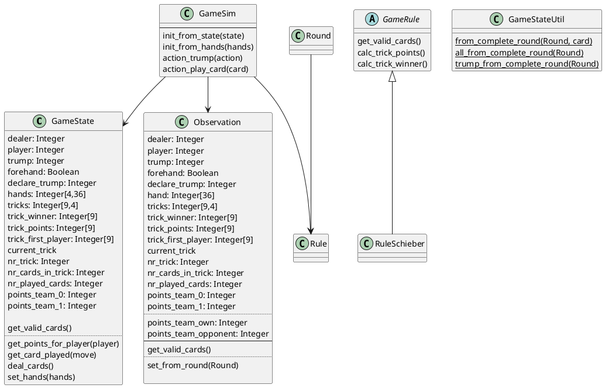

```plantuml

@startuml
class GameState {
dealer: Integer
player: Integer
trump: Integer
forehand: Boolean
declare_trump: Integer
hands: Integer[4,36]
tricks: Integer[9,4]
trick_winner: Integer[9]
trick_points: Integer[9]
trick_first_player: Integer[9]
current_trick
nr_trick: Integer
nr_cards_in_trick: Integer
nr_played_cards: Integer
points_team_0: Integer
points_team_1: Integer

get_valid_cards()
..
get_points_for_player(player)
get_card_played(move)
deal_cards()
set_hands(hands)
}

class GameSim {
---
init_from_state(state)
init_from_hands(hands)
action_trump(action)
action_play_card(card)
}

class Observation
{
dealer: Integer
player: Integer
trump: Integer
forehand: Boolean
declare_trump: Integer
hand: Integer[36]
tricks: Integer[9,4]
trick_winner: Integer[9]
trick_points: Integer[9]
trick_first_player: Integer[9]
current_trick
nr_trick: Integer
nr_cards_in_trick: Integer
nr_played_cards: Integer
points_team_0: Integer
points_team_1: Integer
..
points_team_own: Integer
points_team_opponent: Integer
---
get_valid_cards()
..
set_from_round(Round)

}

abstract class GameRule {
get_valid_cards()
calc_trick_points()
calc_trick_winner()
}

class RuleSchieber {
}

class GameStateUtil {
{static} from_complete_round(Round, card)
{static} all_from_complete_round(Round)
{static} trump_from_complete_round(Round)
}

GameRule <|-- RuleSchieber
Round --> Rule
GameSim --> Rule
GameSim --> GameState
GameSim --> Observation

@enduml
```